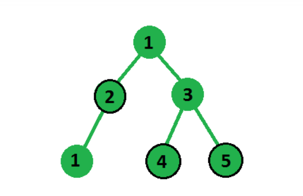
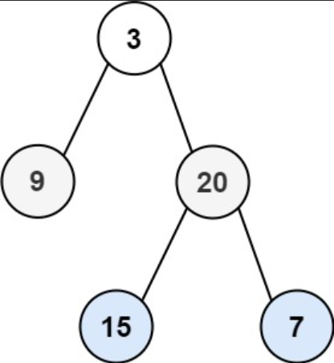
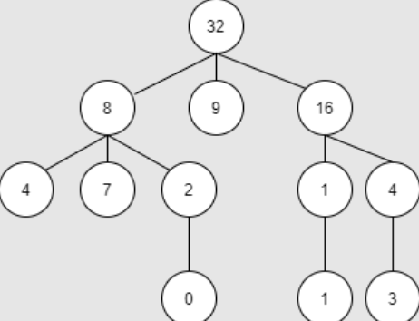

# Задачи върху дървета.


```c++

Node<int>* root = new Node<int>(50);
Node<int>* n1 = new Node<int>(25);
Node<int>* n2 = new Node<int>(75);
Node<int>* n3 = new Node<int>(12);
Node<int>* n4 = new Node<int>(30);
Node<int>* n5 = new Node<int>(60);
Node<int>* n6 = new Node<int>(85);
Node<int>* n7 = new Node<int>(52);
Node<int>* n8 = new Node<int>(70);

root->left = n1;
root->right = n2;
n1->left = n3;
n1->right = n4;
n2->left = n5;
n2->right = n6;
n5->left = n7;
n5->right = n8;

```

## Задача 1 (изпит по ДАА)

Дадено е дърво с произволен брой наследници от цели числа, трябва да изберем подмножество от тези възли, така че сумата от избраните възли да е максимална при ограничение, че два избрани възела в подмножеството не трябва да бъдат директно свързани, т.е. ние сме взели възел в нашата сума, тогава не можем да вземем под внимание нито едно от неговите деца и обратно



## Задача 2

При даден корен на двоично дърво, принтирайте нивата на дървото.



3

9, 20

15, 7

## Задача 3 (Държавен изпит)

Разглеждаме двоично дърво с данни от тип символ и елементи, описвани от следната
структура:
```c++
struct Node 
{
char text;
Node *left;
Node *right;
};
```
Стойностите са малки и главни латински букви, цифри и препинателни знаци. Няма празни сим-
воли (интервал, нов ред, табулация) и символи от разширената ASCII таблица (с код по-голям от 127).
Пример за такова дърво е:


Да се реализира функция printText, която получава като аргумент указател към корен на такова
дърво и извежда на стандартния изход текста, записан във върховете, спазвайки следните правила:
• съдържанието на всяко ниво (елементи с еднаква дълбочина) се извежда на отделен ред;
• ако на дадено място в нивото липсва възел, да се изведе интервал;
• дървото се извежда до последния елемент от последното ниво.
За показаното като пример дърво трябва да се изведе следния текст:

|I|

|am|

|good|

|at␣solvi|

|ng␣p␣␣roblem␣␣␣␣|

|s␣␣!|

Забележка: за яснота на примера в началото и края на всеки ред е добавен символът pipe |, който
printText не трябва да извежда.
Да се демонстрира работата на тази функция в кратка програма.
Забележка: позволено е използването на класовете контейнери от стандартната библиотека STL.

## Задача 4 (Контролно)
Напишете функция, която проверява дали дърво с произволен брой наследници погледнато от ляво е същото като погледнато от дясно.


Погледнат от двете страни е:

```c++
5
3
4
9
```

```c++
Node<int>* root = new Node<int>(5);
root->children.push_back(new Node<int>(3));
root->children.push_back(new Node<int>(9));
root->children.push_back(new Node<int>(3));

root->children[0]->children.push_back(new Node<int>(4));
root->children[0]->children.push_back(new Node<int>(3));
root->children[0]->children.push_back(new Node<int>(7));

root->children[0]->children[2]->children.push_back(new Node<int>(9));

root->children[2]->children.push_back(new Node<int>(5));
root->children[2]->children.push_back(new Node<int>(4));

root->children[2]->children[0]->children.push_back(new Node<int>(2));
root->children[2]->children[1]->children.push_back(new Node<int>(9));
```

## Задача 5 (Контролно)
Дадено е дърво с произволен брой наследници.  "Хубав път" в дървото ще наричаме такъв път, в който стойността на всеки връх се дели на стойността на следващия. Да се дефинира функция, която  приема такова дърво и връща най-дългия "хубав път" започващ от корена.

Пример:



Изход:

```c++
32 16 1 1
```