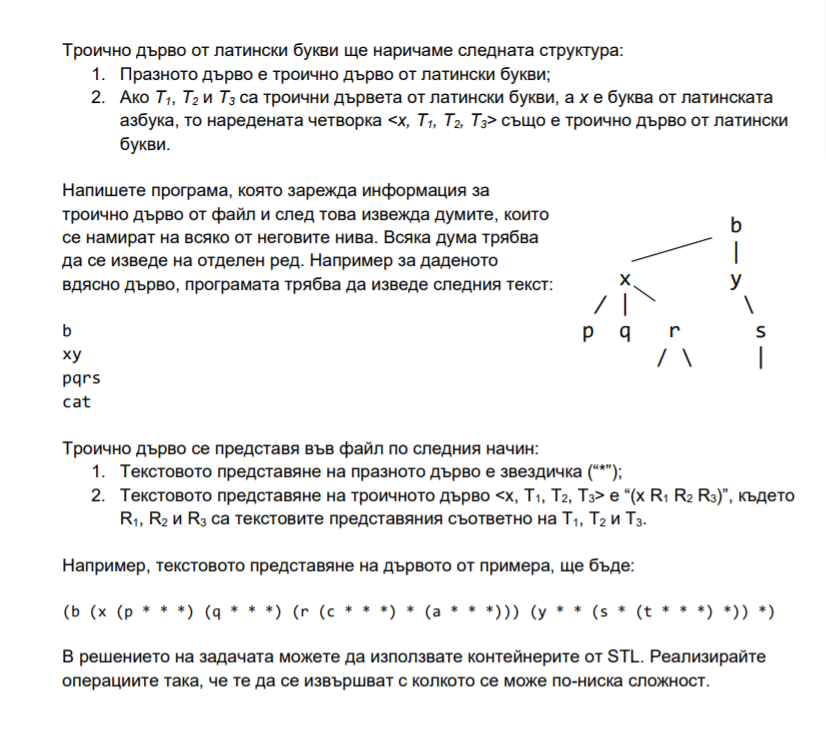

## Задача 1
Да се реализира функция, която добавя елемент в двоично наредено дърво.

## Задача 2
Да се напише функция *contains(Tree\<T>\* tree, const T& elem)* която връща дали елемента се съдържа в двоично дърво. Да се реализира същата функция за двоично наредено дърво.

## Задача 3
Да се напише функция *max((Tree\<T>\* tree)* която връща най - големия елемент в двоично дърво. Да се реализира същата функция за двоично наредено дърво. Да се реализира функция намираща най - малкия елемент.

## Задача 4
Да се реализира функция, която връща височината на двоично дърво.

## Задача 5
Да се напише функция, която обхожда елементите на двоично дърво по схемата ляво-корен-дясно. (още позната като inorder traversal). Извикайте функцията върху двоично наредено дърво. Какво забелязвате?

##  

 <- Стойчо -упр8  ,   Алексис -упр7 ->

##

## Задача 6
 Да се напише функция, която приема указател към корена на двоично дърво от числа и връща *сумата на числата в него*.  

## Задача 7
 Да се напише функция, която приема указател към корена на двоично дърво и връща *броя на елементите му*.  

## Задача 8
 Да се напише функция, която приема указател към корена на двоично дърво с n върха и връща *дали числата от 1 до n се срещат точно веднъж в дървото*.  

## Задача 9  
Да се напише функция, която приема указател към корена на двоично дърво, чиито елементи са символи, и цяло число k и връща *думата на k-тото ниво на дървото*.  

## Задача 10 
Да се напише функция, която приема указател към корена на двоично дърво и връща *всички думи, които се получават обхождайки дървото от корена до някое листо*.  

## Задача 11
 Да се напише функция, която приема указател към корена на двоично дърво и връща *сумата на листата му*.  

## Задача 12
 Напишете функция, която приема указател към корена на двоично дърво и *променя дървото в неговата огледална форма*.  

## Задача 13  

